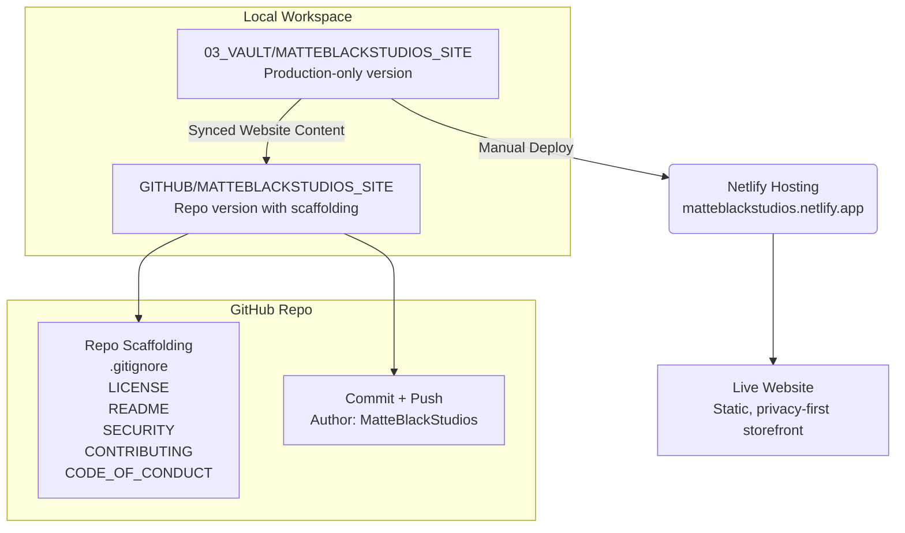

# MATTEBLACK STUDIOS Site

Official static website for [MATTEBLACK STUDIOS](https://matteblackstudios.com) — a privacy-first product studio publishing sovereign AI workflow packs.

**Live site:** [https://matteblackstudios.com](https://matteblackstudios.com)

HTML, CSS, and one local JavaScript file. No frameworks, no CDNs, no analytics, no cookies, no telemetry.

---

## Products

The site catalogs three MATTEBLACK STUDIOS workflow packs:

| Product | GitHub | Gumroad |
|---------|--------|---------|
| **Sovereign AI Starter Pack — Ollama Edition** | [sovereign-ai-starter-pack-ollama](https://github.com/Flakiopai/sovereign-ai-starter-pack-ollama) | [Get on Gumroad](https://matteblackstudios.gumroad.com/l/ejvea) |
| **Local AI Wallpaper & Photo Workflow Pack** | [wallpaper-workflow-pack](https://github.com/Flakiopai/wallpaper-workflow-pack) | [Get on Gumroad](https://matteblackstudios.gumroad.com/l/lxkgbt) |
| **Performance Review Transformation Pack** | [PERFORMANCE_REVIEW_PACK](https://github.com/Flakiopai/PERFORMANCE_REVIEW_PACK) | [Get on Gumroad](https://matteblackstudios.gumroad.com/l/zquqaj) |

Product cards live on [`/PRODUCTS/index.html`](PRODUCTS/index.html).

---

## Sovereign Constraints

These rules are non-negotiable across all site code:

- **No tracking** — no analytics, pixels, session recording, or telemetry
- **No cookies** — no `document.cookie`, `localStorage` identifiers, or similar
- **No external dependencies** — no CDN fonts, scripts, or stylesheets
- **No device detection** — no user-agent sniffing or JavaScript viewport breakpoints
- **CSS-only responsiveness** — layout adapts using `@media (min-width: …)` only

Checkout links (Gumroad) are user-initiated external navigations, not embedded third-party scripts.

---

## Folder Structure

```
index.html              Home page
styles.css              Global design system and layout (mobile-first)
reveal.js               Optional scroll reveals and mobile nav toggle
_headers                Netlify security headers
privacy.html            Privacy policy
terms.html              Terms of service
safety.html             Safety and compliance disclosures
PRODUCTS/
  index.html            Product catalog (three live products)
assets/
  hero-bg.png           Site background image
  performance_review_thumbnail.png
  products/             Product thumbnails
```

---

## Local Preview

From the project root:

```bash
python3 -m http.server 8080
```

Open `http://localhost:8080`. Root-absolute paths (`/styles.css`) require serving from the site root, not opening files directly via `file://`.

---

## Deployment (Netlify)

Deploy the project root as a static site. No install or build step required.

1. Connect this repository to Netlify, or drag-and-drop the site folder.
2. **Build command:** *(none)*
3. **Publish directory:** `/` (repository root)
4. `_headers` applies recommended security headers on Netlify automatically.

A production-only copy of this site is maintained separately for Netlify redeploys. Website content (HTML, CSS, JS, assets) should stay identical between both copies; only repository scaffolding differs here.

---

## Website Architecture



---

## Contributing

See [`CONTRIBUTING.md`](CONTRIBUTING.md), [`SECURITY.md`](SECURITY.md), and [`CODE_OF_CONDUCT.md`](CODE_OF_CONDUCT.md).

---

## License

MIT — see [`LICENSE`](LICENSE).
